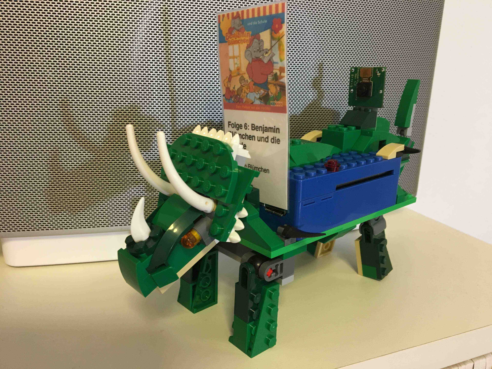
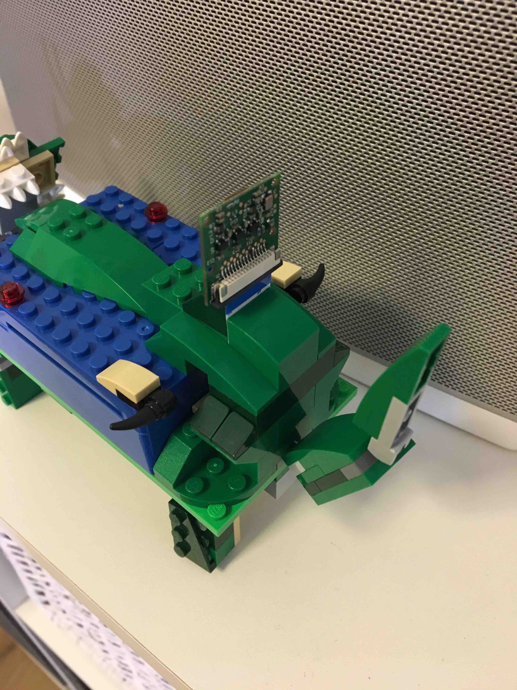
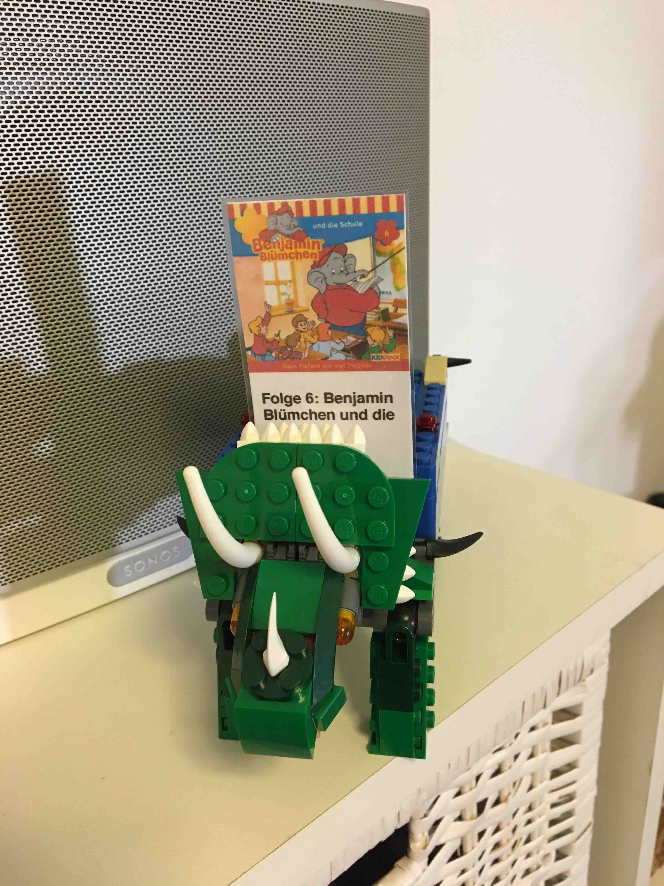
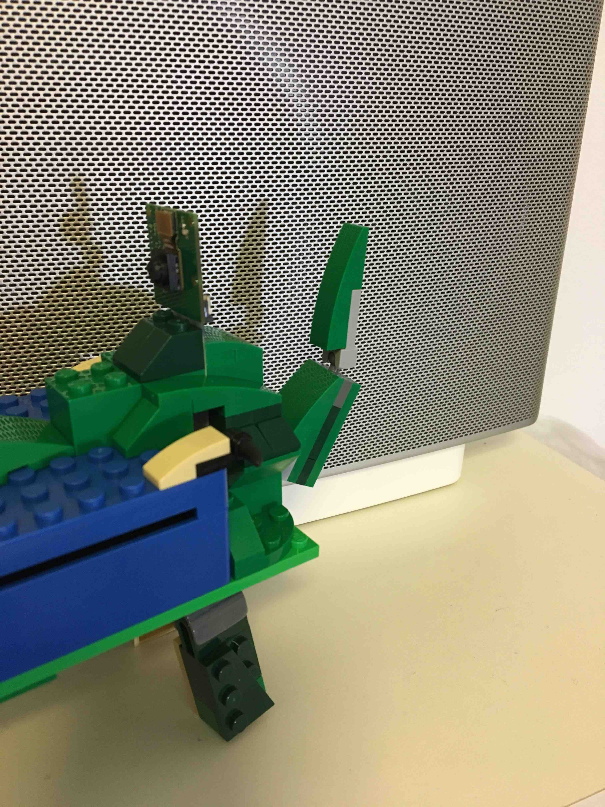
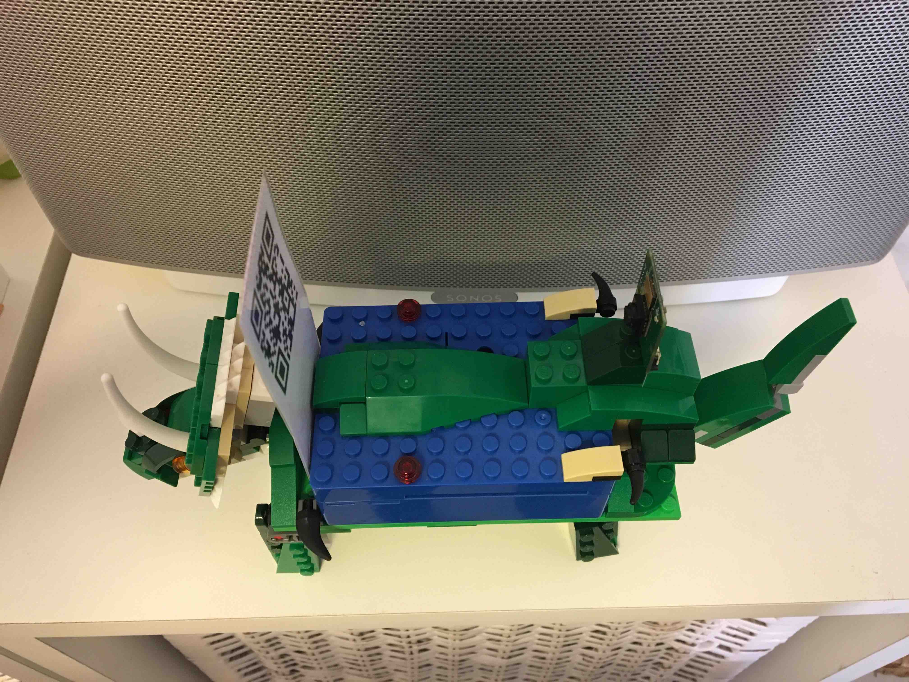
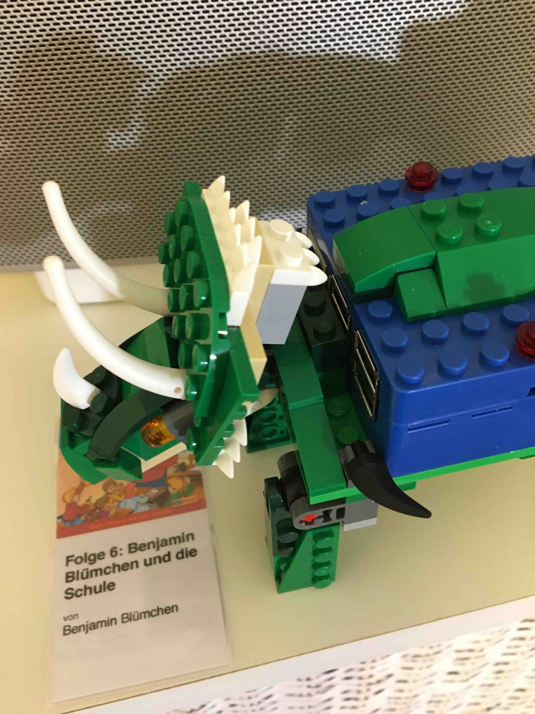
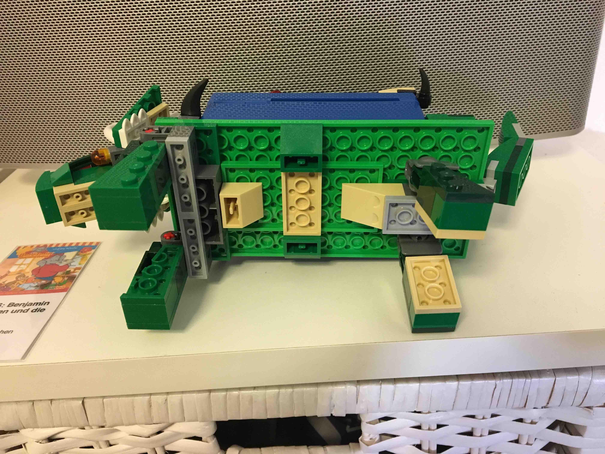
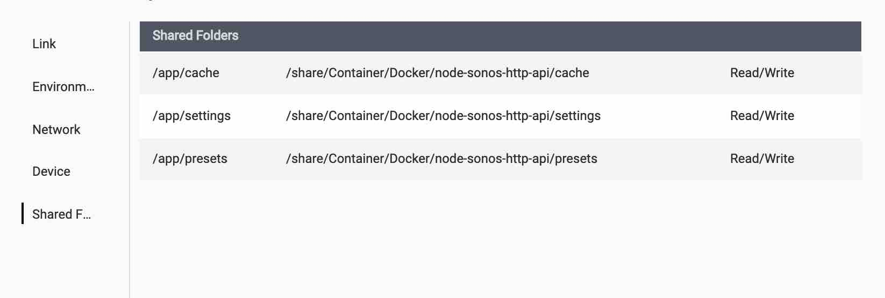
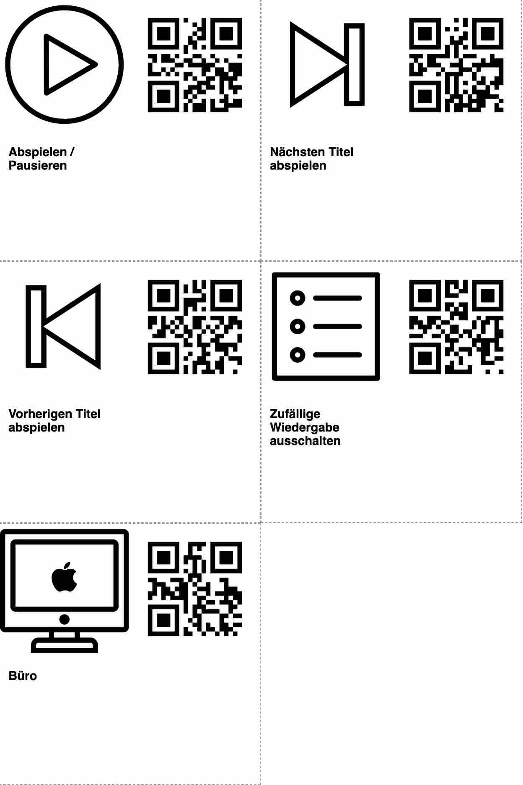

<link href="css/layouts/readme.css" rel="stylesheet"/>

# Dinoqode

A kid-friendly system for controlling Sonos® with QR codes.

<p align="center">







</p>

## What is it?

On the hardware side, it's just a camera-attached Raspberry Pi nested inside some LEGO® and running some custom software that scans QR codes and translates them into commands that control your Sonos® system.

### __Hardware list__
* [Rasperry Pi 3 Model B+](https://www.amazon.de/Raspberry-1373331-Pi-Modell-Mainboard/dp/B07BDR5PDW)
* Rasperry Pi 3 Camera
   * [Raspberry Pi V2.1, 8 MP 1080P Kamera-Modul](https://www.amazon.de/gp/product/B01ER2SKFS/ref=ppx_yo_dt_b_asin_title_o02_s00?ie=UTF8&psc=1) oder
   * [Raspberry Pi V1.3, 5 MP 1080p Kamera-Modul](https://www.amazon.de/gp/product/B01DM8NAI0/ref=ppx_yo_dt_b_asin_title_o00_s00?ie=UTF8&psc=1)
* (optional) [Raspberry Pi 3 Netzteil](https://www.amazon.de/gp/product/B01DP8O5A4/ref=ppx_yo_dt_b_asin_title_o07_s00?ie=UTF8&psc=1)
* (optional) [Pimoroni Blinkt!](https://www.amazon.de/gp/product/B01J7Y332Q/ref=ppx_yo_dt_b_asin_title_o03_s00?ie=UTF8&psc=1)
* [Pi-Blox LEGO Case](https://www.amazon.de/gp/product/B017Z32E80/ref=ppx_yo_dt_b_asin_title_o05_s00?ie=UTF8&psc=1)
* [SanDisk Extreme 32 GB microSDHC](https://www.amazon.de/gp/product/B06XWMQ81P/ref=ppx_yo_dt_b_asin_title_o06_s00?ie=UTF8&psc=1) => 8 GB genügen auch
* [LEGO Classic Mittelgroße Bausteine-Box](https://www.amazon.de/gp/product/B00NVDP3ZU/ref=ppx_yo_dt_b_asin_title_o08_s00?ie=UTF8&psc=1)
* [LEGO Creator Dinosaurier](https://www.amazon.de/gp/product/B01J41DNWM/ref=ppx_yo_dt_b_asin_title_o08_s00?ie=UTF8&psc=1)


On the software side, there are two separate Python scripts:

* Run `node server.js` to show Dinoqode site with instructions and card creator tool.

* Run `python3 qrgen.py` on your primary computer.  It takes a list of songs (from your local music library, Apple Music®, Amazon Music® and/or Spotify®) and commands (e.g. play/pause, next, room-change) and spits out an HTML page containing little cards imprinted with an icon and text on one side, and a QR code on the other.  Print them out, then cut, fold, foil until you're left with a neat little stack of cards.


* Run `python3 qrplay.py` on your Raspberry Pi.  It launches a process that uses the attached camera to scan for QR codes, then translates those codes into commands (e.g. "speak this phrase", "play [song] in this room", "build a queue").

## Installation and Setup

### 1. Raspberry Pi installation

[Download Raspbian operating system image](http://downloads.raspberrypi.org/raspbian/images/raspbian-2019-04-09/2019-04-08-raspbian-stretch.zip)

[Installing operating system images](https://www.raspberrypi.org/documentation/installation/installing-images/)

Before inserting the microSD card to the Raspberry Pi follow step 3  (Enable SSH on a headless Raspberry Pi (add file to SD card on another machine)) on the following link.

[Raspberry Pi SSH headless activation](https://www.raspberrypi.org/documentation/remote-access/ssh/)

#### 1.1 First connection to the Raspberry Pi

Connect your computer and the Raspberry Pi with a lan cable. After this you can connect with ```ssh pi@raspberrypi.local``` (Password: raspberry).

### 2. Prepare your Raspberry Pi

First update the firmware.

```
sudo rpi-update
```

I built this using a Raspberry Pi 3 Model B+ (running Raspbian) and one of the listed camera modules (testet with both).
Things may or may not work with other models (for example, how you control the onboard LEDs varies by model).

Set up the camera module:

```
sudo raspi-config
# Select "5 Interface Options"
# Select "P1 Camera" and choose "Yes"
# Reboot
```

Set up Wi-fi:

```
sudo raspi-config
# Select "2 Network Options"
# Select "N2 Wi-fi" and follow the instructions
```

Update modules on Raspberry PI:

```
sudo apt-get update
```

Install Node.js and NPM on Raspberry PI:

```
sudo apt-get install nodejs npm
sudo npm install -g npm@latest
sudo npm install -g n
sudo n stable
```

Next, install `zbar-tools` (used to scan for QR codes) and test it out:

```
% sudo apt-get install zbar-tools
```

### 3. Start `node-sonos-http-api`

`qrplay` relies on [node-sonos-http-api](https://github.com/Kienz/node-sonos-http-api).

(Note: `node-sonos-http-api` made it easy to bootstrap this project, as it already did much of what I needed.)

It's possible to run `node-sonos-http-api` directly on the Raspberry Pi, so that you don't need an extra machine running.
To install check out the `node-sonos-http-api` and start it:

```
mkdir ~/Developer
cd ~/Developer
git clone https://github.com/Kienz/node-sonos-http-api.git
cd node-sonos-http-api
npm install --production
npm start
```

You can install it on a NAS too. I installed it on my QNAP NAS with a [Docker® image](https://cloud.docker.com/repository/docker/kienz/docker-node-sonos-http-api/).

* Open ContainerStation app
* Create image - search for `kienz/docker-node-sonos-http-api`
* Click create in the search result
* Change settings in the `Advanced Settings` section
* Network - Network Mode - Bridge (Use static IP)
* Device - "Run containers in privileged mode."
* Shared Folders

<p align="left">

</p>


### 4. Generate some cards

#### 4.1 With `qrgen.py`

First, clone the `dinoqode` repo if you haven't already on your primary computer:

```
cd ~/Developer
git clone https://github.com/Kienz/dinoqode.git
cd dinoqode
```

Also install `qrencode`:

```
sudo apt-get install qrencode
```

Next, create a text file that lists the different cards you want to create.  (See `example.txt` for some possibilities.)

To find the title/album id's from Spotify, Amazon Music or Apple Music go to the music service (Spotify/Amazon Music => Browser Version / Apple Music => iTunes) and search for the title/album. If you're in the album open the browser dev tools and copy'n'paste the code from `createDinoqodeCommand.js` into the console and run it `createDinoqodeCommand('album')`. If you want create a card for a single song call it `createDinoqodeCommand('song')`.
Now you should have the complete string with id, artist, title/album name and cover url in your clipboard.

Finally, generate some cards and view the output in your browser:

```
python qrgen.py --input example.txt
open out/index.html
```

It'll look something like this:

<p align="center">

</p>

#### 4.2 With Dinoqode server `node server.js`

First run `npm install` on the root folder of the dinoqode repo.

```
npm install
```

Next, run `node server.js` and open `<IP-RaspberryPI>:5006` in your browser. On the Dinoqode site you can print basic command cards and generate new cards.

### 5. Start `qrplay.py`

On your Raspberry Pi, navigate to the `dinoqode` repo:

```
cd ~/Developer/dinoqode
```

Then, launch `qrplay`, specifying the hostname of the machine running `node-sonos-http-api`:

```
python3 qrplay.py --hostname 0.0.0.0 --default-device "xyz" --default-volume 25 --skip-load
```

If you want to use your own `dinoqode` as a standalone thing (not attached to a monitor, etc), you'll want to set up your Raspberry Pi to launch `dinoqode`, `node-sonos-http-api` and `dinoqode-server` when the device boots:

```
cd ~/Developer
mkdir ~/Developer/logs
cd logs
echo > dinoqode.log
echo > dinoqode-server.log
echo > node-sonos-http-api.log
chmod -R +w .
sudo chown root:adm /home/pi/Developer/logs/dinoqode.log
sudo chown root:adm /home/pi/Developer/logs/dinoqode-server.log
sudo chown root:adm /home/pi/Developer/logs/node-sonos-http-api.log
```

Copy the files from `/pi/etc/systemd/system` to the Raspberry Pi (`/etc/systemd/system`) and enable the services.

```
sudo systemctl enable dinoqode.service
sudo systemctl enable dinoqode-server.service
sudo systemctl enable node-sonos-http-api.service
```

After that `node-sonos-http-api`, `dinoqode` and `dinoqode-server` services should start after reboot.

To see what happens you can look inside the log files `dinoqode.log`, `node-sonos-http-api.log` or `dinoqode-server.log`.

```
tail -F ~/Developer/logs/dinoqode.log
tail -F ~/Developer/logs/dinoqode-server.log
tail -F ~/Developer/logs/node-sonos-http-api.log
```

or

```
journalctl -u dinoqode.service
journalctl -u dinoqode-server.service
journalctl -u node-sonos-http-api.service
```


### 6. Use Blinkt! led bar to display success/failure of commands

Some commands have no output and it's hard to know if the command works or not. Therefore you can add the Blinkt! led bar to you Raspberry Pi.

[Beginning with Blinkt!](https://learn.pimoroni.com/tutorial/tanya/beginning-with-blinkt)

Placing the Blinkt! led bar on the pins of the Raspberry Pi is quite simle. You just have to pay attention to the following.

_The pins on the Pi connect to the holes in the header on the back of the Blinkt! There is a right way and a wrong way. If you look at the Blinkt! you'll see it has rounded corners on one side. This side goes towards the outside of your Pi. The straight edge goes towards your Pi. Push them together gently and you are almost ready to start!_

After placing the Blinkt! on your Raspberry Pi you have to install the Blinkt! library.
```
curl https://get.pimoroni.com/blinkt | bash
```

The `dinoqode` now uses the Blinkt! led to show succesful commands with green light and failure commands with red light.


### 7. Refocus Raspberry Pi camera

To adjust the Raspberry Pi camera you have to turn the lens counterclockwise. The distance between the camera and the card is approx. 10 cm. To focus to this length turn the lens 126° counterclockwise.
The camera model v2 includes a plastic tool to turn the lens.

The camera model v1 have no tool includes. Also you have to cut the border around the lens with a sharp knife to remove the glue points. Otherwise the lens can not be turned.

#### 7.1 Install Terminal Server

```
sudo apt-get update
sudo apt-get install xrdp
```

To check if the xrdp terminal service is running:
````
sudo systemctl status xrdp
````

The status information should display `"Loaded: loaded"` and `"Active: active (running)"`.

#### 7.2 Capture image to better refocus the camera

Run the following command:

````
raspistill -o ~/cam.jpg
````

The image is saved in the users home directory. You can view the image in your terminal server session.

## The Cards

Currently `qrgen` and `qrplay` have built-in support for two different kinds of cards: song cards, and command cards.

Song cards can be generated for tracks in your music library, from Spotify®, from Amazon Music®, from Apple Muscic® or from Sonos Playlists®. For example:

<p align="center">

</p>

Command cards are used to control your Sonos system, performing actions like switching to a different room, pausing/playing the active device, next/previous title, shuffle on/off. Here are some commands (complete list of supported commands can be found in `example.txt`):

<p align="center">

</p>


## This and that

### Siri Shortcuts

[Say to SONOS](https://www.icloud.com/shortcuts/55665fcce0e34dad82a622da1b122638)

Say something and send the sepak command to a Sonos Speaker (with the help of `node-sonos-http-api`).

[Dinoqode](https://www.icloud.com/shortcuts/63157b730b064d1da6e9bb43ec93dd91)

Scan the QR code with your iPhone and play the song/album on a Sonos Speaker.


### Stop Services

```
sudo systemctl stop dinoqode.service
sudo systemctl stop dinoqode-server.service
sudo systemctl stop node-sonos-http-api.service
```


### Questions?
You can ask me for help on [Twitter](https://twitter.com/kienzle_s).


## Acknowledgments

This was a fun little project to put together mainly because other folks already did much of the hard work.

Hearty thanks to the authors of the following libraries:

* [qrocodile](https://github.com/chrispcampbell/qrocodile)
* [qrencode](https://github.com/fukuchi/libqrencode)
* [node-sonos-http-api](https://github.com/jishi/node-sonos-http-api)
* [spotipy](https://github.com/plamere/spotipy)
* [webkit2png](https://github.com/paulhammond/webkit2png)


## License

`Dinoqode` is released under an MIT license. See the LICENSE file for the full license.
